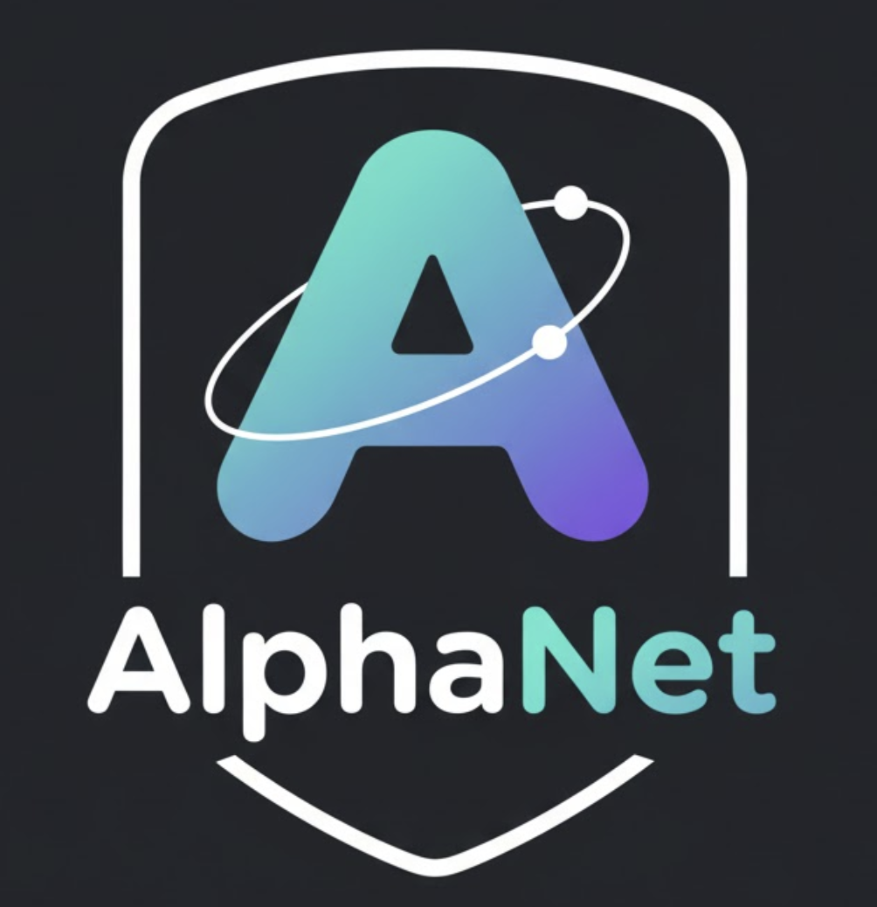

<p>
  
</p>

# AlphaNet

We present **AlphaNet**, a local frame-based equivariant model designed to tackle the challenges of achieving both accurate and efficient simulations for atomistic systems.  **AlphaNet** enhances computational efficiency and accuracy by leveraging the local geometric structures of atomic environments through the construction of equivariant local frames and learnable frame transitions. And inspired by Quantum Mechanics, AlphaNet **introduces efficient multi-body message passing by using contraction of matrix product states** rather than common 2-body message passing.  Notably, AlphaNet offers one of the best trade-offs between computational efficiency and accuracy among existing models. Moreover, AlphaNet exhibits scalability across a broad spectrum of system and dataset sizes, affirming its versatility.
markdown
## Update Log (v0.1.2-beta)

### Major Changes

1. **Add lammps mliap interface**
2. **Slight change of model arch**
3. **Add finetune option**

     

## Installation Guide

### Installation Steps

1. **Create a Conda Environment**

   Open your terminal or command prompt and run:

   ```bash
   conda create -n alphanet_env python=3.8 #or later version
   ```

2. **Activate the Environment**

   ```bash
   conda activate alphanet_env
   ```

3. **Install Required Packages**

   Navigate to your desired installation directory and run:

   ```bash
   pip install -r requirements.txt
   ```

4. **Clone the Repository**

   ```bash
   git clone https://github.com/zmyybc/AlphaNet.git
   ```

5. **Install AlphaNet**

   Navigate into the cloned repository and install AlphaNet in editable mode:

   ```bash
   cd AlphaNet
   pip install -e .
   ```

   This allows you to make changes to the codebase and have them reflected without reinstalling the package.

## Quick Start

### Basic Usage

The settings are put into a config file, you can see the json files provided as example, or see comments in `alphanet/config.py` for some help. 

In this version, you can set **"zbl" in the "model" field to true to enable ZBL potential**.

Our code is based on pytorch-lightning, and in this version we provide command line interaction, which makes AlphaNet easier to use. However if you are already familar with python and torch, which is not that hard, it would be great to use the model in a torch way and do further exploration. 

:warning: If you train AlphaNet in your own code, it is important to turn on the gradient clipping. :warning:

In all there are 3 commands:
1. Train a model:

```bash 
alpha-train example.json # use --help to see more functions, like multi-gpu training resuming from ckpt...
```
2. Convert from lightning ckpt to state_dict ckpt:
```bash 
alpha-conv -i in.ckpt -o out.ckpt # use --help to see more functions
```
2. Finetune a converted ckpt:
```bash 
alpha-train example.json --finetune /path/to/your.ckpt
```
4. Evaluate a model and draw diagonal plot:
```bash 
alpha-eval -c example.json -m /path/to/ckpt # use --help to see more functions
```
The functions above can also be used in a script way like previous version, see `old_README`.

### Make dataset
To prepare the training dataset in format of pickle, you can use:

1. from deepmd:

```bash 
python scripts/dp2pic_batch.py
```

2. from extxyz:

```bash 
python scripts/xyz2pic.py
```

So if you work in AlphaNet directory, the dataset should be organized as:
```
AlphaNet/
├── input.json
└── dataset/
    ├── my_dataset_1/ #This is your self-decided name, which should also written in your json file
    │   ├── raw/
    │   └── processed/ # would appear after you first run training, when you need to change the dataset, you should remove it
    ├── my_dataset_2/ #This is your self-decided name, which should also written in your json file
    │   ├── raw/
    │   └── processed/
    └── custom_dataset/#This is your self-decided name, which should also written in your json file
        ├── raw/
        └── processed/
```
There is also an ase calculator, you can use it in jax or torch in this:

```python 
from alphanet.infer.calc import AlphaNetCalculator
from alphanet.infer.new_haiku import AlphaNetCalculator #JAX version
from alphanet.config import All_Config
from ase.build import bulk
# example usage
atoms = bulk('Cu', 'fcc', a=3.6, cubic=True)

calculator = AlphaNetCalculator(
        ckpt_path='./alex_0410.ckpt',#./pretrained/OMA/haiku/haiku_params.pkl haiku ckpt
        device = 'cuda',
        precision = '32',
        config=All_Config().from_json('./pretrained/OMA/oma.json'),
)

atoms.calc = calculator
print(atoms.get_potential_energy())

```

## Pretrained Models

Current pretrained models (due to the arch changes, previous pretrained models would need update, which will be done asap):

For materials:

- [AlphaNet-oma-v1.5](pretrained/OMA): A model trained on the OMAT24 dataset, and finetuned on sALEX+MPtrj.

## Use AlphaNet in LAMMPS

See [mliap_lammps](mliap_lammps.md)

## License

This project is licensed under the GNU License - see the [LICENSE](LICENSE) file for details.

## Acknowledgments

We thank all contributors and the community for their support. Please open an issue or disscusion  if there are any problems. 

## Citation
[AlphaNet: Scaling Up Local-frame-based Interatomic Potential](https://arxiv.org/abs/2501.07155)


